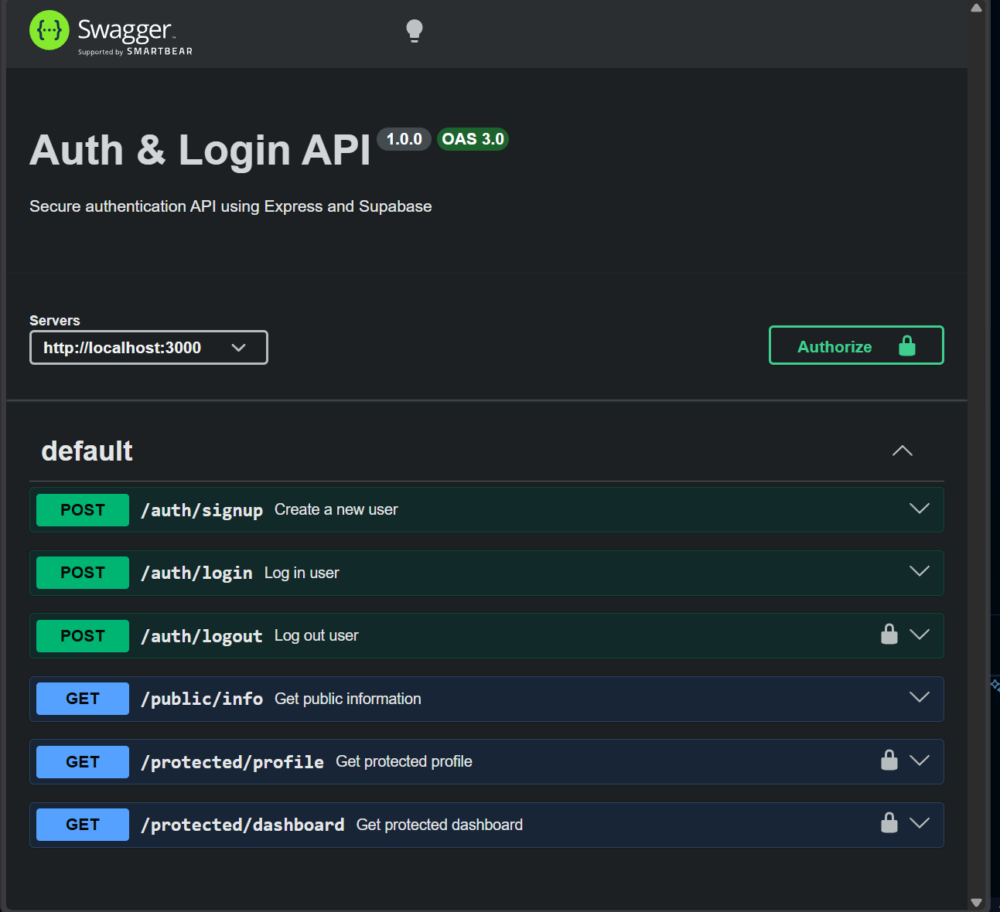

# Auth & Login API

A secure authentication API made with Node.js, Express and Supabase.

The API allows users to sign up, log in and log out. It also uses JWT access tokens to protect routes so only authenticated users can access them.

## Technologies Used

- Node.js
- Express
- Supabase Auth
- JWT authentication
- Swagger UI

## Setup

Clone the repository:

```bash
git clone https://github.com/Simply-Adam/FlyRank-A4-Adam
cd Auth-N-Login
```
Install the dependencies:
```bash
npm install
```
Create a .env file in the root folder:
```bash
SUPABASE_URL=your_project_url
SUPABASE_KEY=your_anon_key
PORT=3000
```
The Supabase URL and anon key can be found in the Supabase project settings.

## Run the Project

Start the server with:
```bash
npm start
```
The server runs at:

http://localhost:3000

Swagger documentation is available at:

http://localhost:3000/docs


## Swagger UI

The API can also be tested using Swagger UI at:

`http://localhost:3000/docs`

